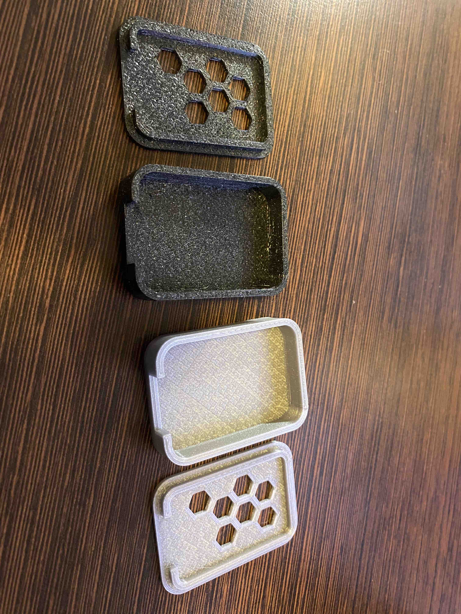
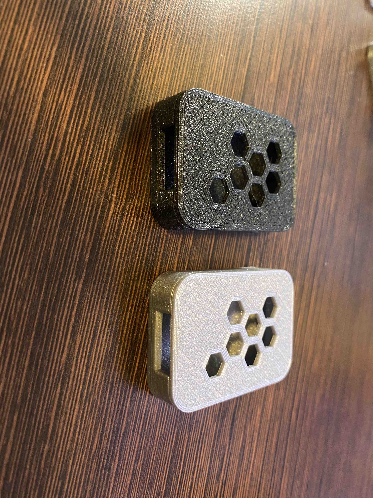

# coolaz-case
3D printable case for the coolaz PCB found 
[here](https://github.com/tlm/coolaz-board)

STL files can also be downloaded from
[Printables](https://www.printables.com/model/252386-coolaz-case).

# Printing Specs
I have sucessfully printed this case with both PLA and PETG at a 0.2mm layer
height.

# Pictures

# License
Licensed under MIT.

# Contributions
Welcome, please reach out or create an issue if you would like to help improve
the design.
